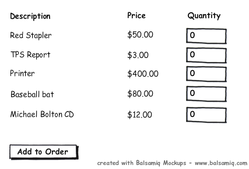

# Daxko Interview Project

The project is a simple ordering system that allows someone to order a specified quantity of items from a list.

The purpose of this exercise is to evaluate a general knowlege of C#, ASP.NET MVC, JavaScript, and good coding practices.

**NOTE:** we want to respect your time and do not expect you to go all out and spend many hours perfecting this project. Find the right balance of actually performing a refactor for the higher priority parts of the code vs. being prepared to discuss the other parts that you would want to refactor given more time.

## Scenario

You are tasked with adding some new functionality to an existing legacy application. This application was poorly coded, violates many of the SOLID principles, and has a lot of issues with maintainability. Feel free to refactor the code however you see fit as you add the new functionality and be prepared to discuss your changes with us.

### User story: As someone who orders multiple products at the same time, I would like to be able to type in the quantity for each item then press the "Add to Order" button once and have the contents of my cart be refreshed without doing a full page reload (read: AJAX).

Come prepared to have a friendly and fun conversation with other developers about what you did to the product and why you chose to do it that way.

## Technical notes

*   The OrderRepository is meant to be an abstraction over the database layer. There is no reason to setup a database and actually save data. We don't expect you to do that in this exercise unless you particularly want to show off something around data storage.
*   There is no need to add functionality to make this project complete other than the user story you are tasked (for example, deleting items you add to your order). However, feel free to refactor anything that is within the project already to get it to what you would consider a "clean" state (NOTE: this isn't a requirement, but at least come prepared to discuss parts of the system you would have like to have refactored but was not a top priority).
*   Feel free to use any tools or libraries that you see fit.
*   Don't worry about supporting IE. (This is like your high school physics books saying "when solving this problem, disregard friction, assume the world is in a vacuum, and ignore reality" - we have to support IE to some degree in our business, but we can assume we live in a vacuum for this exercise and be lifted from the burden of IE for a while)
*   Bonus points if you use a modern JavaScript UI framework other than vanilla jQuery for satisfying the AJAX requirement in the user story (examples: Vue, Angular, React, or some other flavor of the month). If you have never used any of these frameworks, then that's fine - use it as an opportunity to learn something new and discuss with us what you learned.  If you don't feel like adding another dependency adds value, that's cool too - be prepared to discuss the trade offs of pulling in a new UI framework dependency and when (if ever) that makes sense.

## Something not clear?

Feel free to contact [ctucker@daxko.com](mailto:ctucker@daxko.com?subject=Daxko%20Interview%20Project%20Question) if you have any questions about this project.